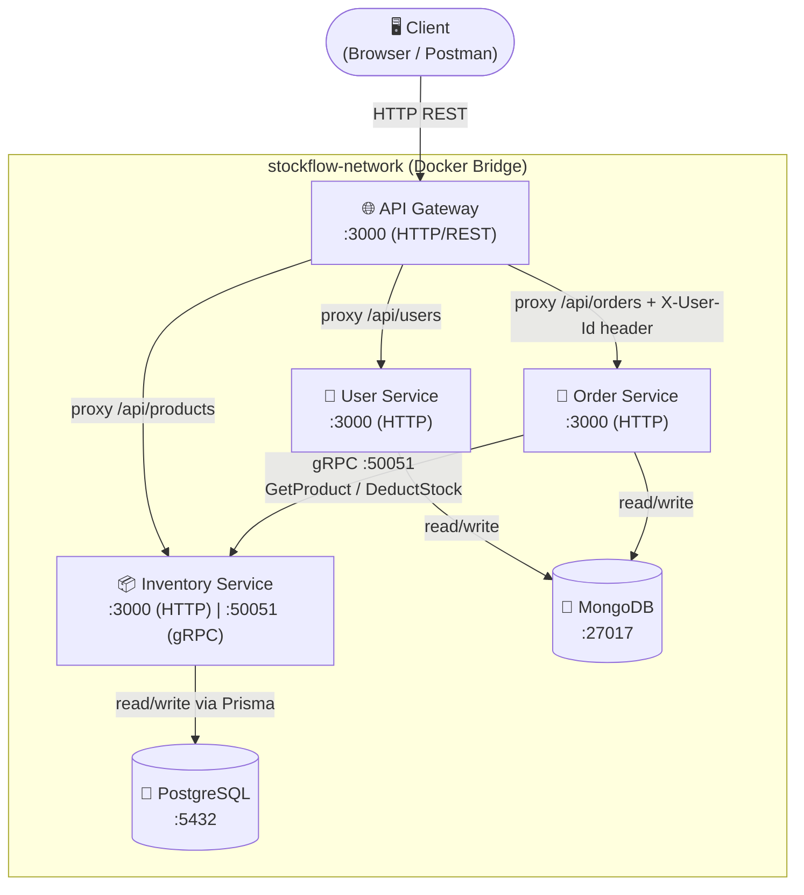
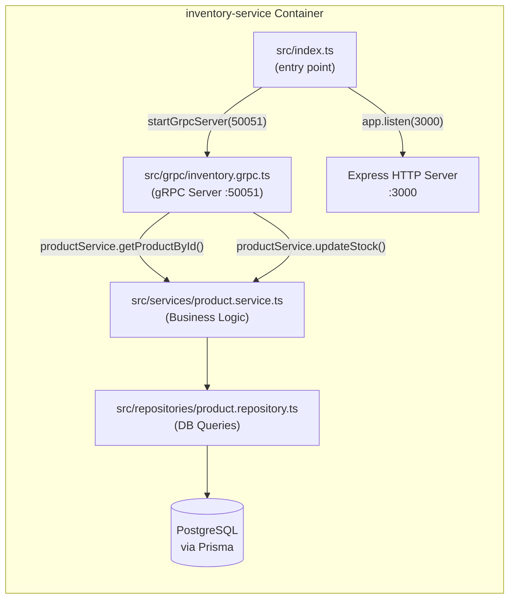
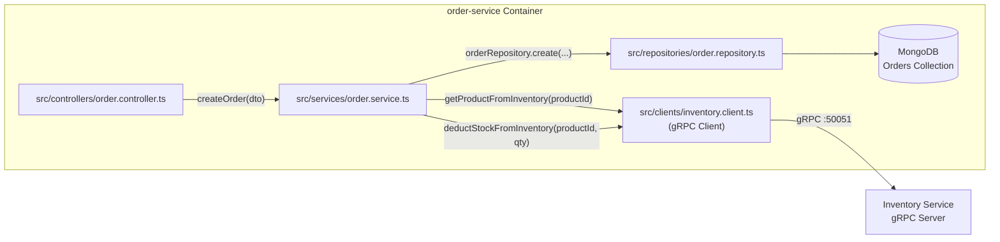
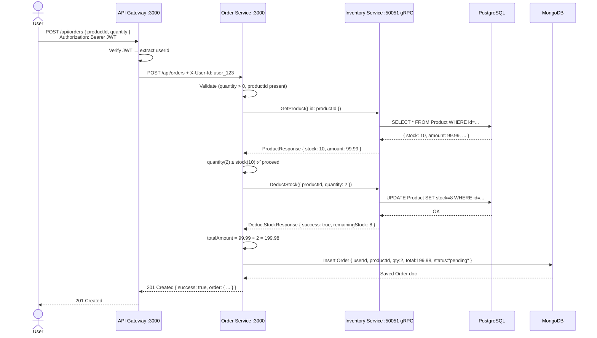
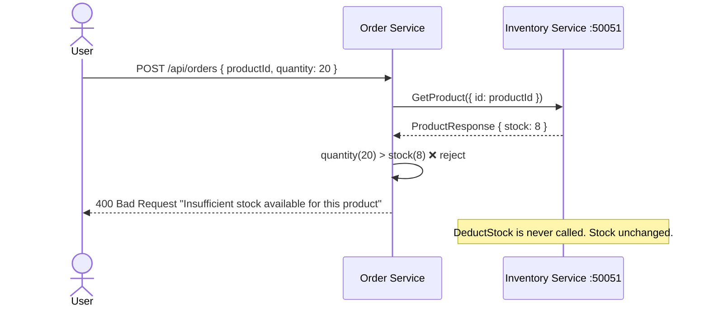
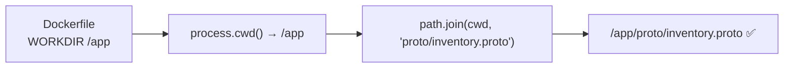

# gRPC Communication in StockFlow

## Overview

StockFlow uses **gRPC** (Google Remote Procedure Call) for service-to-service communication between the **Order Service** and the **Inventory Service**. The REST-facing API Gateway communicates with services via **HTTP/REST**, while the internal microservice communication uses **gRPC over TCP** for performance and type safety.

---

## High-Level Architecture



---

## Communication Protocols at a Glance

| Route | Source | Destination | Protocol |
| :--- | :--- | :--- | :--- |
| `/api/users` | API Gateway | User Service | HTTP REST |
| `/api/products` | API Gateway | Inventory Service | HTTP REST |
| `/api/orders` | API Gateway | Order Service | HTTP REST |
| `GetProduct` | Order Service | Inventory Service | **gRPC** |
| `DeductStock` | Order Service | Inventory Service | **gRPC** |

---

## Why gRPC?

| Feature | REST (HTTP/JSON) | gRPC (Protobuf/HTTP2) |
| :--- | :--- | :--- |
| **Serialization** | JSON (text) | Binary (Protobuf) — 3-10x smaller |
| **Schema** | Optional (OpenAPI) | Strict contract (`.proto` file) |
| **Type Safety** | None at runtime | Enforced by generated code |
| **Performance** | Slower | Faster (binary + HTTP/2 multiplexing) |
| **Use Case** | Public APIs | Internal service communication |

---

## Proto Contract: `inventory.proto`

Both services share the same contract defined in their `proto/inventory.proto` files. This file acts as the **API contract** between `order-service` (client) and `inventory-service` (server).

```protobuf
syntax = "proto3";
package inventory;

// The gRPC service definition — defines what methods the server exposes
service InventoryService {
  rpc GetProduct (GetProductRequest) returns (ProductResponse);
  rpc DeductStock (DeductStockRequest) returns (DeductStockResponse);
}

// --- GetProduct ---
message GetProductRequest {
  string id = 1;
}

message ProductResponse {
  string id = 1;
  string name = 2;
  int32 stock = 3;
  double amount = 4;
  string category = 5;
}

// --- DeductStock ---
message DeductStockRequest {
  string productId = 1;
  int32 quantity = 2;
}

message DeductStockResponse {
  bool success = 1;
  string message = 2;
  int32 remainingStock = 3;
}
```

> [!NOTE]
> Each field has a unique **field number** (e.g. `string id = 1`). These are stable binary identifiers used when encoding/decoding Protobuf messages — not array positions. Never change them once deployed or old clients will break.

---

## gRPC Server: Inventory Service

The Inventory Service starts **two servers** at startup:
1. An **HTTP/Express server** (port `3000`) for REST APIs
2. A **gRPC server** (port `50051`) for internal service calls



### Server Startup (`src/index.ts`)

```typescript
import { startGrpcServer } from "./grpc/inventory.grpc";

const PORT = Number(process.env.PORT) || 3000;
const GRPC_PORT = Number(process.env.GRPC_PORT) || 50051;

connectDB();
startGrpcServer(GRPC_PORT);  // gRPC on :50051

app.listen(PORT, () => {     // HTTP on :3000
  console.log(`Inventory Service HTTP running at http://localhost:${PORT}`);
});
```

### gRPC Handlers (`src/grpc/inventory.grpc.ts`)

```typescript
const PROTO_PATH = path.join(process.cwd(), "proto/inventory.proto");
const packageDefinition = protoLoader.loadSync(PROTO_PATH, { ... });
const inventoryProto = grpc.loadPackageDefinition(packageDefinition).inventory;

server.addService(inventoryProto.InventoryService.service, {

  // GetProduct: look up a product by ID
  GetProduct: async (call, callback) => {
    const product = await productService.getProductById(call.request.id);
    callback(null, { id, name, stock, amount, category }); // success
    // OR callback({ code: grpc.status.NOT_FOUND }); // error
  },

  // DeductStock: check availability then reduce stock atomically
  DeductStock: async (call, callback) => {
    const { productId, quantity } = call.request;
    const product = await productService.getProductById(productId);
    if (product.stock < quantity) {
      callback(null, { success: false, message: "Insufficient stock", remainingStock: product.stock });
    } else {
      const updated = await productService.updateStock(productId, { stock: product.stock - quantity });
      callback(null, { success: true, remainingStock: updated.stock });
    }
  },
});

server.bindAsync("0.0.0.0:50051", grpc.ServerCredentials.createInsecure(), ...);
```

---

## gRPC Client: Order Service

The Order Service acts as the **gRPC client**, calling the Inventory Service's gRPC server. The client stub is initialized once when the module loads, and reused across all requests.



### Client Initialization (`src/clients/inventory.client.ts`)

```typescript
const PROTO_PATH = path.join(process.cwd(), "proto/inventory.proto");
const packageDefinition = protoLoader.loadSync(PROTO_PATH, { ... });
const inventoryProto = grpc.loadPackageDefinition(packageDefinition).inventory;

// Connects to inventory-service on port 50051 inside Docker network
export const inventoryClient = new inventoryProto.InventoryService(
  process.env.INVENTORY_GRPC_HOST || "inventory-service:50051",
  grpc.credentials.createInsecure()   // no TLS needed inside private Docker network
);

// Promisified wrapper for GetProduct
export function getProductFromInventory(id: string): Promise<ProductResponse> {
  return new Promise((resolve, reject) => {
    inventoryClient.GetProduct({ id }, (err, response) => {
      if (err) return reject(err);
      resolve(response);
    });
  });
}

// Promisified wrapper for DeductStock
export function deductStockFromInventory(productId: string, quantity: number): Promise<DeductStockResponse> {
  return new Promise((resolve, reject) => {
    inventoryClient.DeductStock({ productId, quantity }, (err, response) => {
      if (err) return reject(err);
      resolve(response);
    });
  });
}
```

---

## Full Order Creation Flow



---

## Insufficient Stock Flow



---

## Proto File Co-location

```
StockFlow/
├── inventory-service/
│   └── proto/
│       └── inventory.proto      ← gRPC SERVER reads this at /app/proto/inventory.proto
│
└── order-service/
    └── proto/
        └── inventory.proto      ← gRPC CLIENT reads this at /app/proto/inventory.proto
```

Each service owns its proto files. This is the standard microservices pattern — services are **independently deployable** without relying on a shared filesystem.

> [!IMPORTANT]
> Both copies of `inventory.proto` must always be kept **in sync**. If you add a new RPC method or field, update **both** services before rebuilding.

---

## Proto Path Resolution Inside Docker



```typescript
// Works correctly inside Docker because WORKDIR /app is set in Dockerfile
const PROTO_PATH = path.join(process.cwd(), "proto/inventory.proto");
```

---

## Environment Variables

| Service | Variable | Value | Purpose |
| :--- | :--- | :--- | :--- |
| `inventory-service` | `GRPC_PORT` | `50051` | Port gRPC server listens on |
| `order-service` | `INVENTORY_GRPC_HOST` | `inventory-service:50051` | gRPC server address to connect to |

The hostname `inventory-service` is resolved automatically by **Docker's internal DNS** — Docker maps container names to their internal IP addresses within `stockflow-network`.

---

## gRPC Status Codes

| Code | Meaning | Where Used |
| :--- | :--- | :--- |
| `grpc.status.NOT_FOUND` | Product doesn't exist | `GetProduct` handler on DB miss |
| `grpc.status.INTERNAL` | Unexpected server error | `DeductStock` handler on exception |
| `null` (first callback arg) | Success | Both handlers on happy path |

---

## Adding a New RPC Method

1. **Update proto in both services**:
   ```protobuf
   service InventoryService {
     rpc GetProduct (GetProductRequest) returns (ProductResponse);
     rpc DeductStock (DeductStockRequest) returns (DeductStockResponse);
     rpc RestoreStock (RestoreStockRequest) returns (RestoreStockResponse); // new
   }
   message RestoreStockRequest { string productId = 1; int32 quantity = 2; }
   message RestoreStockResponse { bool success = 1; int32 newStock = 2; }
   ```

2. **Add handler** in `inventory-service/src/grpc/inventory.grpc.ts`:
   ```typescript
   RestoreStock: async (call, callback) => { ... }
   ```

3. **Add client wrapper** in `order-service/src/clients/inventory.client.ts`:
   ```typescript
   export function restoreStockInInventory(productId: string, quantity: number): Promise<...> { ... }
   ```

4. **Rebuild**:
   ```bash
   docker compose up --build
   ```
